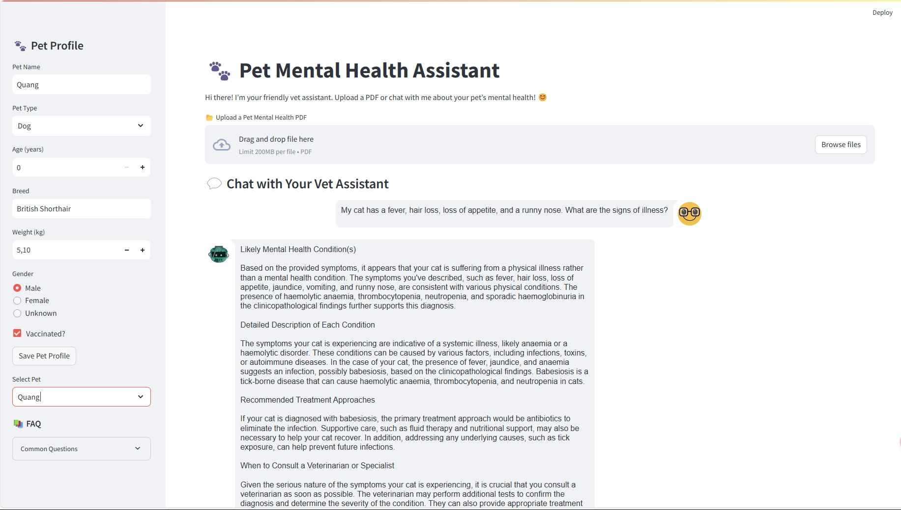
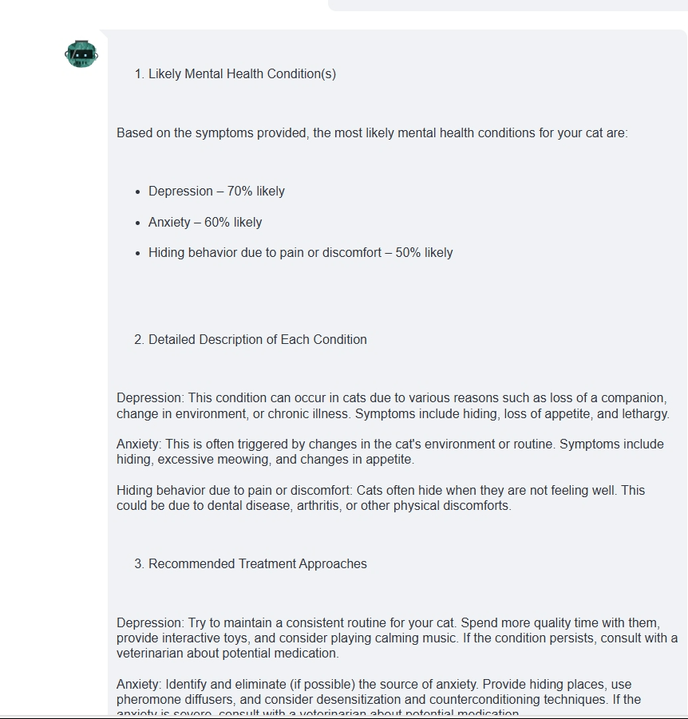
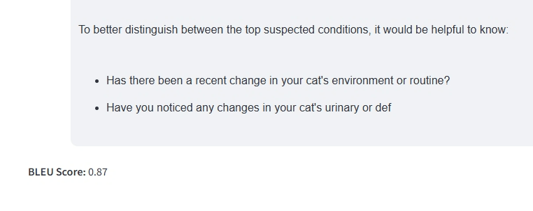

<<<<<<< HEAD
# Pet Health Assistant Project

## Overview
This project creates a veterinary assistant chatbot that helps pet owners with health concerns. It uses web crawling to collect pet health data (a trusted Vietnamese pet care resource), vector embeddings for semantic search, and large language model integration for intelligent responses.

<div align="center">
  
</div>

## Features
- Data collection through web crawling from web
- Vietnamese-focused pet health knowledge base
- Vector database for semantic search
- AI-powered conversation with veterinary knowledge
- Multiple LLM backend options 

## System Architecture

```
┌─────────────┐    ┌───────────────┐    ┌────────────────┐    ┌────────────┐
│ Web Crawler │───►│ Content Parser │───►│ Text Embedding │───►│  LanceDB   │
│ (petmart.vn)│    └───────────────┘    └────────────────┘    └────────┬───┘
└─────────────┘                                                        │
                                                                       │
┌──────────────────────────────────────────────────────────────────────┘
│
▼
┌────────────────┐    ┌──────────────┐    ┌───────────────┐
│  User Question │───►│ Flask Server │◄───┤ LLM (Groq or  │
│                │    │              │    │  OpenRouter)  │
└────────────────┘    └──────────────┘    └───────────────┘
                             │
                             ▼
                      ┌──────────────┐
                      │   Response   │
                      └──────────────┘
```

## Project Components

### 1. Data Collection (`1-extraction.py`)
- Web crawler that extracts 
- Focuses on the pet health and veterinary sections
- Stores links in JSON format for further processing
- Handles pagination and implements rate limiting

### 2. Content Extraction (`2-crawler.py`)
- `FirecrawlApp` class for structured content extraction
- Processes links collected in the previous step
- Saves crawled data with metadata
- Implements logging and error handling

### 3. Vector Database Creation (`3-embedding.py`)
- Text chunking for better search results
- Embedding generation using `multilingual-e5-large` model 
- LanceDB integration for efficient vector storage
- Progress tracking using tqdm

### 4. Web Application (`app.py`)
- Flask web application with responsive UI
- Integration with Groq and OpenRouter APIs
- Context-aware responses using vector similarity search
- Session management for conversation history

## Data Flow

1. **Data Collection Phase**:
   - Web crawler extracts pet health information web
   - Content is parsed and cleaned
   - Text is split into manageable chunks

2. **Embedding Phase**:
   - Text chunks are converted to vector embeddings
   - Embeddings are stored in LanceDB

3. **Query Phase**:
   - User asks a question about pet health
   - Question is converted to vector embedding
   - Similar vectors are retrieved from database
   - Context is sent to LLM with user query
   - LLM generates a veterinary-knowledge based response

## Setup Instructions

### Installation

1. Clone the repository:
```bash
git clone <repository-url>
cd pet-health-assistant
```

2. Create and activate a virtual environment:
=======
# 🐾 Pet Mental Health Assistant
A Streamlit-based AI assistant that helps pet owners assess their pets' mental health by analyzing uploaded PDF documents and user-provided symptoms. It uses LLMs, vector embeddings, and BLEU scoring to retrieve and evaluate relevant health advice.
## 📌 Table of Contents
- [Introduction](#-introduction)
- [Features](#-features)
- [Installation](#-installation)
- [Usage](#-usage)
- [Dependencies](#-dependencies)
- [Configuration](#-configuration)
- [Project Structure](#-project-structure)
- [Examples](#-examples)
- [Troubleshooting](#-troubleshooting)
- [Contributors](#-contributors)
## 🧠 Introduction
**Pet Mental Health Assistant** provides an interactive chatbot interface for pet owners to understand possible mental health issues their pets might be facing. Users can upload veterinary PDFs, input symptoms, and receive personalized advice powered by large language models and retrieval-augmented generation (RAG).
## ✨ Features
* 📄 Upload and process PDF documents with mental health guidelines.
* 🔍 Semantic search using FAISS vector store.
* 💬 Chatbot interface powered by HuggingFace LLM (Mixtral-8x7B).
* ✅ BLEU Score evaluation against reference responses.
* 🐶 Pet profile manager for personalized context.
* 🧾 Saves and loads chat history across sessions.
* 📋 Symptom checklist for quick input.
## ⚙️ Installation
1. **Clone the repository**
```bash
git clone https://github.com/your-username/pet-mental-health-assistant.git
cd pet-mental-health-assistant
```
2. **Create a virtual environment and activate it**
>>>>>>> 29b36e7aba80f2f41efea87a70be4b0dcf6ed69b
```bash
python -m venv venv
source venv/bin/activate  # On Windows: venv\Scripts\activate
```
<<<<<<< HEAD

3. Install required packages:
```bash
pip install -r requirements.txt
```

4. Set up environment variables:
Create a `.env` file in the project root with:
```
GROQ_API_KEY= your_groq_api_key
HUGGINGFACE_API_KEY= your_huggingface_api_key
FIRECRAWL_API_KEY= your_firecrawl_api_key
OPENROUTER_API_KEY = your_openrouter_api_key
```

### Running the Data Pipeline

1. Collect links:
```bash
python 1-extraction.py
```

2. Extract content:
```bash
python 2-crawler.py
```

3. Generate embeddings and create vector database:
```bash
python 3-embedding.py
```

### Starting the Web Application

```bash
python app.py
```

The application will be available at http://127.0.0.1:5000/

## Usage
1. Visit the web interface in your browser
2. Type questions about pet health 
3. Optionally switch between LLM backends in the settings

## Example Questions (Vietnamese)
- "Chó của tôi bị nôn và tiêu chảy, tôi nên làm gì?"
- "Làm thế nào để điều trị ghẻ cho mèo?"
- "Những triệu chứng của bệnh viêm da ở thú cưng?"
- "Cách chăm sóc thú cưng sau phẫu thuật?"
- "Thức ăn nào tốt cho chó bị bệnh dạ dày?"

## Acknowledgments
- Special thanks to petmart.vn for being the knowledge source for this project
- This project is for educational purposes only
=======
3. **Install dependencies**
```bash
pip install -r requirements.txt
```
4. **Set up environment variables**
Create a `.env` file in the root directory:
```ini
HUGGINGFACEHUB_API_TOKEN=your_huggingface_token_here
```
## ▶️ Usage
Run the Streamlit app:
```bash
streamlit run main.py
```
Once the interface loads in your browser, you can:
* Upload a PDF document with pet mental health content.
* Enter symptoms or use the checklist.
* Get personalized analysis and suggested actions.
* View BLEU Score comparing chatbot output with reference answers.
## 📦 Dependencies
* `streamlit`
* `PyMuPDF` (fitz)
* `langchain`
* `HuggingFaceHub`
* `nltk`
* `faiss-cpu`
* `python-dotenv`
* `sentence-transformers`
* `streamlit_chat`
Install all via:
```bash
pip install -r requirements.txt
```
## ⚙️ Configuration
* `HUGGINGFACEHUB_API_TOKEN`: Required for accessing the LLM from HuggingFace.
* `data/`: Default directory for storing:
  * Uploaded PDFs
  * FAISS vector stores
  * Pickled chat history
## 🗂 Project Structure
```
.
├── app.py                              # Main Streamlit app
├── prompt_template.py                  # Template used for chatbot prompts
├── requirements.txt
├── .env                                # Environment variables
├── data/
│   ├── chat_history.pkl
│   └── pet_mental_health_vector_store.pkl
```
## 🧪 Examples
**Input Symptom**:
```
My dog is hiding a lot and not eating.
```
**Output**:
Based on your pet's symptoms, they might be experiencing depression (70%) or anxiety (60%). Try maintaining a stable routine and consult a vet if the behavior persists.
**BLEU Score**: 0.85

## 👥 Contributors
* Nguyễn Hữu Quang – Initial development and design

## 🖼️ Application Preview
"If you have data in PDF format, please upload it to help make the chatbot smarter."





*Screenshot showing the Pet Mental Health Assistant interface with symptom input, PDF upload, and chatbot response.*
>>>>>>> 29b36e7aba80f2f41efea87a70be4b0dcf6ed69b
