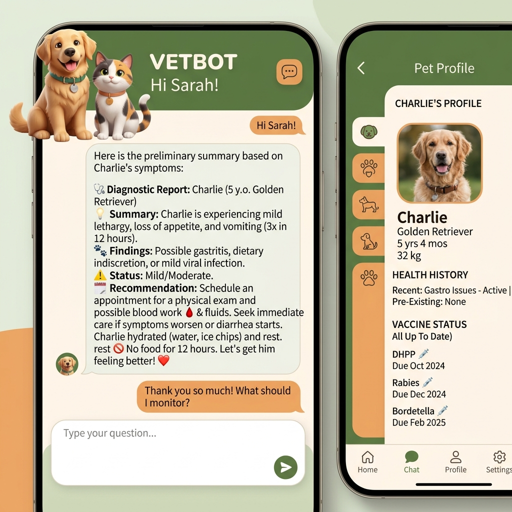

# PawsitiveMind - Mental Health Chatbot


Provide empathetic, 24/7 mental health support using an intelligent Retrieval-Augmented Generation (RAG) chatbot. Designed for wellness platforms, counseling centers, and health tech developers, PawsitiveMind leverages LanceDB and the lightning-fast Groq API to deliver sub-second, contextually accurate responses grounded in a vast library of therapeutic dialogues.



## ✨ Key Features

- **Extract and embed thousands of therapeutic dialogues** efficiently using sentence-transformers and LanceDB's serverless vector store.
- **Respond with ultra-low latency** utilizing the Groq API for rapid token generation.
- **Maintain context across long conversations** with advanced LangChain text splitters and memory management.
- **Provide a comforting user experience** via a lightweight, accessible Flask web UI.
- **Scrape and update knowledge bases automatically** with robust, built-in crawler scripts (`2-crawler.py`).
- **Support multiple LLM providers seamlessly**, with drop-in integrations for OpenAI and open-source local models.

## 🚀 Quick Start

Get your compassionate chatbot running in under 5 minutes.

```bash
# 1. Clone the repository
git clone https://github.com/quangkmhd/Chatbot_mentalhealth_cat-dog.git
cd Chatbot_mentalhealth_cat-dog

# 2. Install dependencies
pip install -r requirements.txt

# 3. Configure environment variables
echo "GROQ_API_KEY=your_api_key_here" > .env
echo "OPENAI_API_KEY=your_openai_key_here" >> .env

# 4. Start the Flask chat interface
python app.py
```

**Expected Output:**
```text
 * Serving Flask app 'app'
 * Debug mode: on
 * Running on http://127.0.0.1:5000
```
Open your browser to `http://127.0.0.1:5000` to start chatting with the mental health assistant immediately.

## 📦 Installation

Choose the method that best aligns with your deployment strategy.

### Method 1: Standard Python Setup

Ideal for local testing and modification.

```bash
python -m venv venv
source venv/bin/activate
pip install -r requirements.txt
```

### Method 2: Docker Compose (Production Ready)

If you plan to scale the application or run it alongside other services.

```bash
# docker-compose.yml (create one based on app.py)
docker-compose build
docker-compose up -d
```

## 💻 Usage Examples

### Example 1: Scraping and Extracting Data

**Problem:** You need to build a specialized knowledge base from curated mental health resources before the bot can answer questions.

```bash
# Run the crawler script to fetch articles
python 2-crawler.py --source "https://mentalhealth-example.org/articles"

# Extract the text and clean it
python 1-extraction.py
```
**Expected Output:** A `plain_links.json` or structured dataset folder populated with clean, usable text documents ready for embedding.
*Concept: The data ingestion pipeline is separated into discrete scripts, ensuring you can rebuild the knowledge base automatically whenever new therapeutic guidelines are released.*

### Example 2: Generating the Vector Database

**Problem:** The raw text needs to be converted into mathematical vectors so the AI can perform semantic search.

```python
# 3-embedding.py
from langchain_text_splitters import RecursiveCharacterTextSplitter
from sentence_transformers import SentenceTransformer
import lancedb

# Initialize LanceDB
db = lancedb.connect("./data/lancedb")
table = db.create_table("therapy_docs", schema=[("vector", "vector(384)"), ("text", "string")])

# Embed and insert
model = SentenceTransformer('all-MiniLM-L6-v2')
texts = ["Cognitive behavioral therapy focuses on...", "Mindfulness helps reduce anxiety..."]
vectors = model.encode(texts)

data = [{"vector": v.tolist(), "text": t} for v, t in zip(vectors, texts)]
table.add(data)
```
*Concept: LanceDB stores the embeddings locally without requiring a heavy server, allowing the chatbot to look up relevant context in milliseconds.*

### Example 3: Running a CLI Chat Session

**Problem:** You want to test the RAG logic and prompt engineering without launching the full web interface.

```bash
# Run the pure chat logic script
python 4-chat.py
```

```text
User: I've been feeling extremely overwhelmed with work lately and can't sleep.
Bot: I hear you. It sounds like work-related stress is significantly impacting your well-being and sleep. Based on therapeutic guidelines, establishing a strict "wind-down" routine an hour before bed can help signal to your brain that it's time to rest. Would you like to explore some specific relaxation techniques together?
```
*Concept: `4-chat.py` orchestrates the LanceDB retrieval, injects the context into the Groq LLM prompt, and returns the generated empathetic response.*

## 🔧 Troubleshooting

- **Groq API Rate Limits (HTTP 429):**
  - *Cause:* Sending too many requests per minute on the free tier.
  - *Solution:* Implement an exponential backoff in `4-chat.py` or upgrade your Groq API plan.
- **LanceDB Connection Issues:**
  - *Cause:* Corrupted database files or missing write permissions in the `./data` directory.
  - *Solution:* Delete the `./data/lancedb` folder and re-run `3-embedding.py` to rebuild the index from scratch.
- **BeautifulSoup Crawler Blocking:**
  - *Cause:* Target websites blocking Python's default user-agent during `2-crawler.py` execution.
  - *Solution:* Add a randomized User-Agent header in the `requests.get()` call within the crawler script.

## 📚 Documentation Links

- **[System Prompt Engineering](./docs/SYSTEM_PROMPT.md)**  
  Delve into the precise prompt architecture that gives the chatbot its compassionate, empathetic persona. Explore how specific instructions guide the LLM to process retrieved therapeutic context, ensuring responses are consistently safe, supportive, and perfectly tuned for mental wellness.

- **[Integrating OpenAI Models](./docs/OPENAI_SETUP.md)**  
  Learn how to seamlessly switch from Groq to OpenAI's powerful GPT models for enhanced reasoning. This guide walks you through the exact environment configurations and API payload adjustments required to upgrade your chatbot's conversational capabilities.

- **[Deploying to Heroku/Render](./docs/DEPLOYMENT.md)**  
  Take your mental health assistant from local development to a globally accessible production environment. Discover step-by-step instructions for containerizing the Flask app, configuring persistent LanceDB storage, and managing secure environment variables in the cloud.

## 🤝 Contributing

We are passionate about using AI for mental health and welcome your contributions!

1. Fork the repository.
2. Create a feature branch: `git checkout -b feature/better-empathy-prompts`
3. Commit your changes: `git commit -m 'Improve system prompt for anxiety topics'`
4. Push to the branch: `git push origin feature/better-empathy-prompts`
5. Open a Pull Request.

Please ensure your changes align with ethical guidelines regarding AI-generated health advice.

## 📄 License

This project is licensed under the Apache 2.0 License. See the `LICENSE` file for full text.

## 🙏 Credits

- UI inspiration from modern chat platforms.
- Vector search powered by [LanceDB](https://lancedb.com/).
- LLM inference accelerated by [Groq](https://groq.com/).
